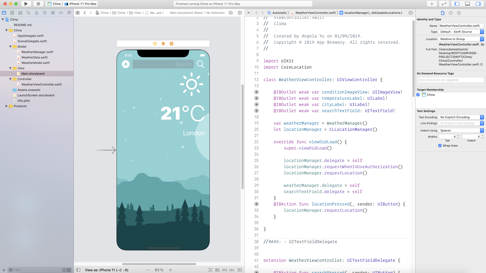

#  Clima

A dark-mode enabled weather app using OpenWeather API to display a chosen location's weather and/or your current GPS location's weather.

## Concepts learned during this project

* How to create a dark-mode enabled app.
* How to use vector images as image assets.
* How to use the UITextField to get user input. 
* Learn about the delegate pattern.
* Swift protocols and extensions. 
* Swift guard keyword. 
* Swift computed properties.
* Swift closures and completion handlers.
* Learn to use URLSession to network and make HTTP requests.
* Parse JSON with the native Encodable and Decodable protocols. 
* Learn to use Grand Central Dispatch to fetch the main thread.
* Learn to use Core Location to get the current location from the phone GPS. 

### Condition Codes
```
switch conditionID {
        case 200...232:
            return "cloud.bolt"
        case 300...321:
            return "cloud.drizzle"
        case 500...531:
            return "cloud.rain"
        case 600...622:
            return "cloud.snow"
        case 701...781:
            return "cloud.fog"
        case 800:
            return "sun.max"
        case 801...804:
            return "cloud.bolt"
        default:
            return "cloud"
        }
```


## License

  [MIT](LICENSE)
